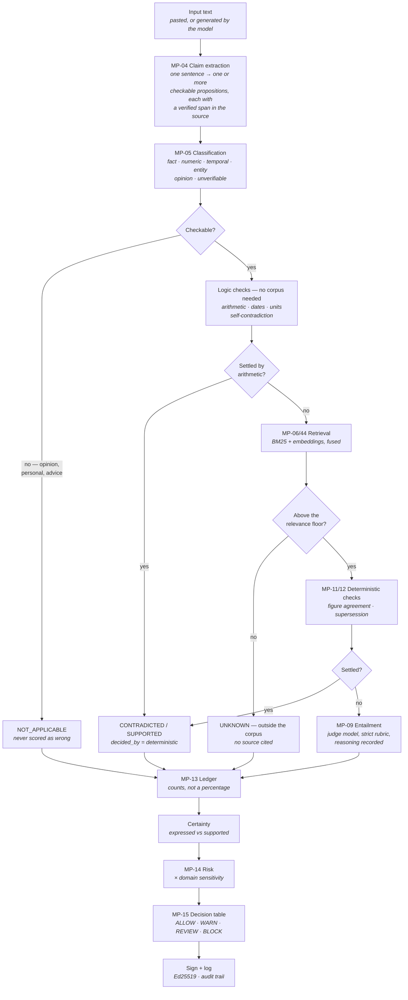
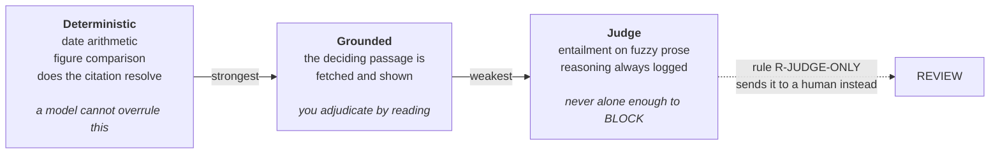
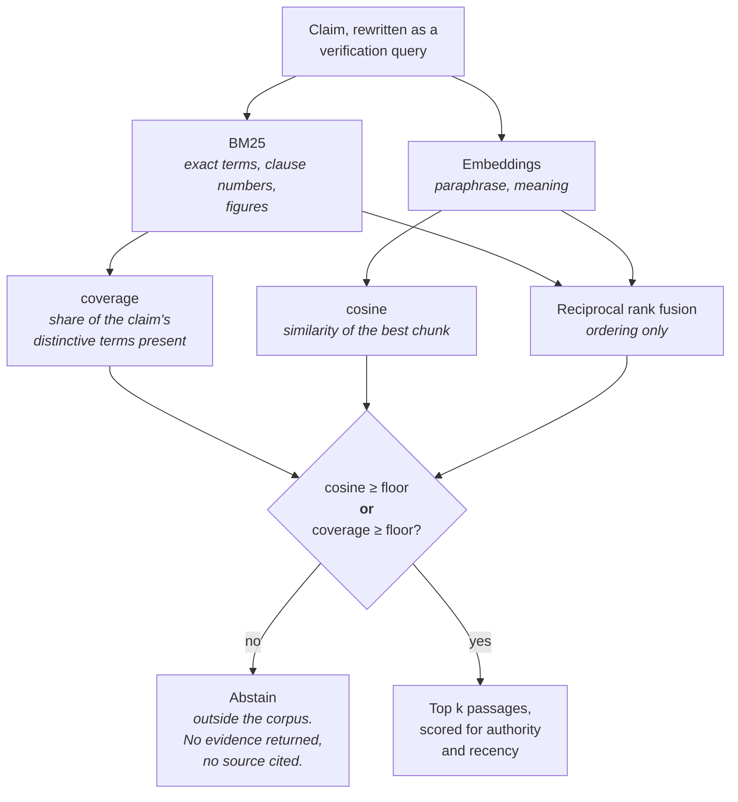
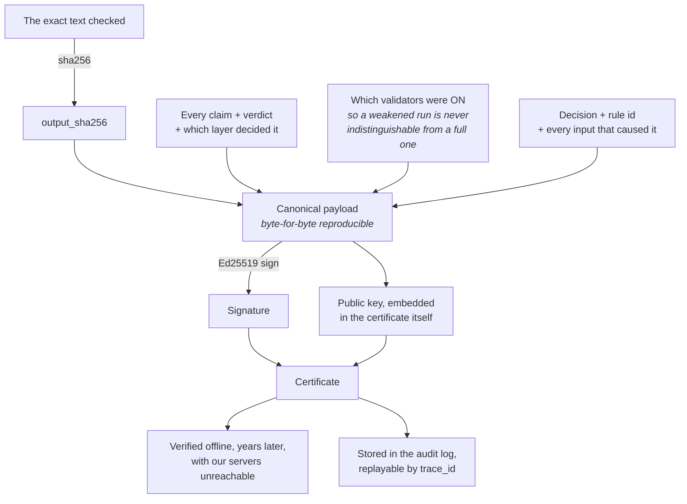
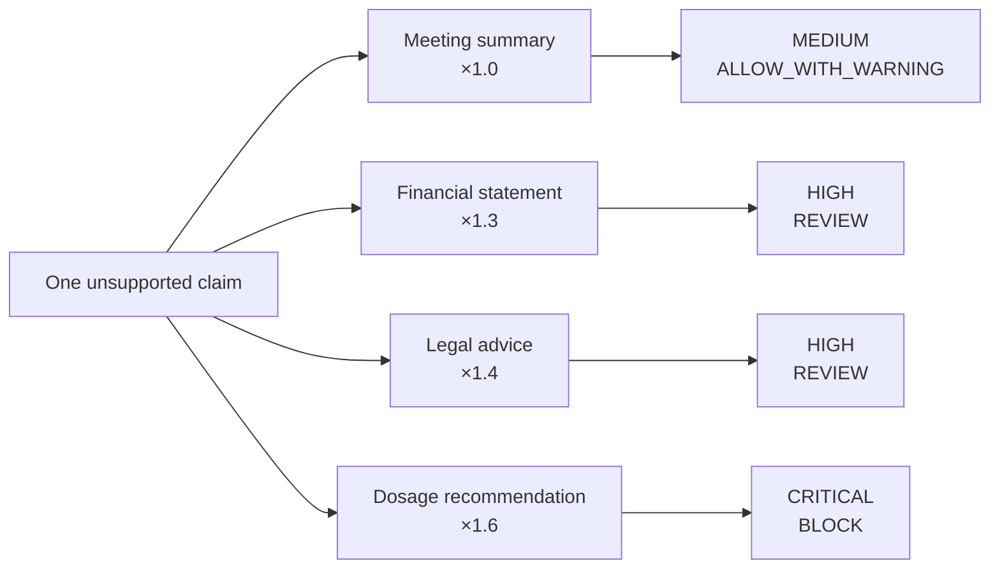

# v1.1 — diagnosis and plan

Written 2026-08-16 after the first real use of the deployed lab exposed a class of failure the
smoke tests could not see. Read with [02-build-notes.md](02-build-notes.md) (what v1 does) and
hand [04-handoff.md](04-handoff.md) to whoever implements this.

**Live:** <https://reliability-lab.vercel.app> · **repo:** `github.com/chaithanya812/AEGI` ·
**code:** [`lab/`](lab/)

---

## 1. What went wrong, precisely

Two inputs broke it:

```
4 plus 3 equals 23.
Adolf Hitler and Albert Einstein were good friends.
```

Both returned `UNKNOWN`, and the explanation cited **the photosynthesis paper** as the source
for the arithmetic claim. The verdict was technically honest — it did not guess — but it read
as if the system were incompetent, which for a trust product is the same thing as being
incompetent.

### The root cause: reciprocal rank fusion discards the similarity score

From the audit log, top-evidence score grouped by verdict:

| Verdict | n | avg | min | max |
|---|---|---|---|---|
| CONTRADICTED | 30 | 0.02180 | 0.01639 | 0.03279 |
| SUPPORTED | 8 | 0.02459 | 0.01639 | 0.03279 |
| PARTIALLY_SUPPORTED | 7 | 0.01874 | 0.01639 | 0.03279 |
| UNKNOWN | 3 | 0.02168 | 0.01639 | 0.03226 |

**Identical ranges to five decimal places.** The score is pure rank arithmetic —
`1 / (60 + rank + 1)` — so rank 0 is always `0.016393` and rank 0 in both rankers is always
`0.032787`. Whether the chunk is a perfect match or the least-bad of 47 irrelevant ones, the
number is the same.

RRF is a good *ordering* function and a useless *confidence* function. Fine for "which of
these is most relevant", incapable of answering "is any of these relevant at all". Because
`relevance` is computed as `score / best`, the top hit always displays **1.00** — which is
how a photosynthesis paper ended up presented as a perfectly relevant source for `4 + 3`.

> There is currently no number anywhere in the system that can say *"this evidence is
> irrelevant."* Every downstream honesty guarantee assumes one exists.

### Five separate defects, in order of how bad they look

| # | Defect | Where | Severity |
|---|---|---|---|
| **D1** | No abstention signal — RRF throws away cosine and BM25 magnitude | `pipeline/retrieval.py` | **critical** |
| **D2** | `UNKNOWN` claims still cite irrelevant evidence as "(source: …)" | `pipeline/safe_response.py` `_cite()` | **critical** — actively misleading |
| **D3** | No arithmetic checker, so `4 + 3 = 23` needs RAG it should never touch | missing module | high |
| **D4** | MP-11 treats arithmetic operands as measurable figures ("the claim states a figure (4)") | `pipeline/citation.py` | medium — noise |
| **D5** | `relevance` displayed as `score/best`, always 1.00 for the top hit | `pipeline/retrieval.py` | medium — dishonest number on screen |

**D2 deserves emphasis.** Saying *"could not be checked either way (source: Photosynthesis —
process summary)"* implies we consulted that document as evidence about arithmetic. We didn't;
retrieval merely handed it over and the judge dismissed it. Printing it as a source is the one
thing in the current build that is not just unhelpful but **untrue**.

---

## 2. Should we remove RAG? No — but the framing has to change

Removing retrieval would remove the only thing that makes any factual verdict possible. What
is actually broken is that retrieval is **unbounded**: it always returns something, and nothing
downstream can tell that "something" from nothing.

But there is a real product problem underneath your instinct, and it is the more important one:

> **Our corpus is 16 documents we wrote. Anything a client cares about is outside it.**

Right now a client types a question about their own business and gets `UNKNOWN` — correct, and
useless to them. That makes the corpus look like a limitation. It should be the feature.

### The fix: three retrieval modes, explicit on screen

```
┌─ EVIDENCE SOURCE ──────────────────────────────────────────────┐
│  ● Demo pack (16 docs)   ○ Your documents   ○ Off — logic only  │
└────────────────────────────────────────────────────────────────┘
```

| Mode | What it is | Why it exists |
|---|---|---|
| **Demo pack** | The current bundled corpus | Rehearsed cases stay deterministic. Never depends on the client's wifi or their file formats. |
| **Your documents** | They paste or upload; we chunk, embed and index in-session | **This is the mode that closes deals.** "Upload your contract, then ask it anything." |
| **Off — logic only** | No retrieval. Arithmetic, dates, internal consistency, self-contradiction, false certainty | Proves how much is caught with *no corpus at all*, which is the answer to "so it only works on documents you prepared?" |

The third mode is the one nobody expects and it reframes the whole product: with retrieval
switched off entirely, `4 plus 3 equals 23` still gets caught, by arithmetic. That is a much
stronger demonstration than any amount of corpus.

### Reference implementations worth reading before building the upload path

Not to adopt wholesale — our pipeline is the differentiator and a framework would bury it —
but the ingestion shape is solved and worth copying rather than re-deriving:

| Repo | Take from it |
|---|---|
| [infiniflow/ragflow](https://github.com/infiniflow/ragflow) | Deep document parsing, and **visualising the chunks** so users see how their file was split. That visualisation is itself a demo asset. |
| [bigint/rag.computer](https://github.com/bigint/rag.computer) | Clean upload → chunk → embed → hybrid-search REST shape. Closest to what we need. |
| [joungminsung/OpenDocuments](https://github.com/joungminsung/OpenDocuments) | Connector + parser + metadata layering, and citation plumbing. |
| [Yigtwxx/Awesome-RAG-Production](https://github.com/Yigtwxx/Awesome-RAG-Production) | Production checklists; use it to sanity-check what we're skipping. |

Published guidance converges on the numbers we need: for answerable queries the top chunk's
cosine similarity typically **exceeds 0.55**, thresholds of 0.6–0.7 favour recall, 0.9+ favour
precision, and a confidence gate should combine *several* signals — top similarity, result
count, reranker score — rather than trusting one. ([Confidence-Aware RAG, Microsoft](https://techcommunity.microsoft.com/blog/azuredevcommunityblog/confidence-aware-rag-teaching-your-ai-pipeline-to-acknowledge-uncertainty/4515061), [retrieval settings deep dive](https://medium.com/@nandagopalan392/a-deep-dive-into-retrieval-settings-for-rag-systems-2036d9d01e9f))

**Do not hardcode 0.55 from a blog post.** Measure it against our corpus — see W2 below.

---

## 3. The plan, in dependency order

### W1 — Give retrieval an abstention signal *(fixes D1, D5; unblocks everything)*

In `reciprocal_rank_fusion`, keep the raw scores alongside the rank score. Use RRF for
**ordering** and raw signals for **abstention**. Two independent signals, both must fail before
we abstain — conservative, so we don't over-abstain and lose real catches:

| Signal | Meaning | Provisional floor |
|---|---|---|
| `cosine` | Embedding similarity of the best chunk | `< 0.55` |
| `coverage` | Fraction of the claim's distinctive terms present in the chunk | `< 0.30` |

`coverage` is deliberately interpretable — *"this passage contains none of the words the claim
is about"* is something you can say out loud to a client, unlike a cosine value.

On abstention: `evidence = []`, status `UNKNOWN`, `decided_by = deterministic`, and reasoning
that names the real situation:

> *"Nothing in the indexed corpus addresses this claim — the closest passage matched 0.21
> against a 0.55 floor. Reported as outside the corpus rather than judged."*

Also store both raw signals on `EvidenceItem` and **replace the `relevance` field** with the
real cosine. No more 1.00-by-construction.

### W2 — Calibrate the floors instead of guessing them (MP-46)

Build the retrieval evaluation harness. A golden set of ~40 pairs: half that *should* retrieve
a named document, half that should abstain (`4 plus 3 equals 23`, `who is my landlord`, `is
Pluto a planet` — anything genuinely outside 16 documents). Plot the score distributions, put
the threshold in the gap, and record recall@k / abstention precision in CI.

This was listed as "next" in v1. It is now a prerequisite: **every threshold in the system is
currently a guess, including the authority weights and the 0.35 relative cutoff.**

### W3 — Checkers that need no corpus at all *(fixes D3, D4)*

New `pipeline/arithmetic.py`. All deterministic, all `decided_by = deterministic`:

- **Arithmetic** — `4 plus 3 equals 23`, `4 + 3 = 23`, `12 times 12 is 140`, `half of 80 is 45`.
  Parse, evaluate exactly, compare. → `CONTRADICTED`, with the true value stated.
- **Percentage consistency** — *"revenue was GBP 2.8bn, up 33% from GBP 2.1bn"*. Check
  `2.1 × 1.33 ≈ 2.8`. Extremely common in real business writing and nobody checks it by hand.
- **Internal self-contradiction** — the output disagreeing with *itself*: "it remains the
  tallest structure at over 500 metres … the Burj Khalifa is the tallest tower". Needs no
  corpus, only the text.
- **Unit and magnitude sanity** — a person weighing 700 kg, a contract running 400 years, a
  percentage above 100 where it cannot be.

Also fix D4: exclude arithmetic operands from MP-11's figure comparison. `4` in `4 plus 3` is
an operand, not a measurement.

> Strategically this is the highest-value workstream. It makes the lab look sharp on exactly
> the inputs a client tries first — mental arithmetic and self-contradiction — and it works
> with retrieval switched off, which is the demo beat that reframes the product.

### W4 — Never cite evidence we didn't rely on *(fixes D2)*

In `safe_response._cite()`: cite only when the verdict actually rests on that passage
(`decided_by` is `grounded` or `deterministic` **and** the check that fired names it). For
`UNKNOWN`, print no source and say plainly that the claim falls outside the corpus. Extend the
same rule to the UI — an `UNKNOWN` claim should show a "nothing retrieved above the floor"
state, not an evidence card.

### W5 — Certificates a human can actually read

You couldn't open the download and couldn't tell what it was for. Both fair. Today it is raw
JSON with no explanation of what it attests to.

**Three changes:**

1. **An on-screen certificate that reads like a document** — plain English above the hex.
   What was checked, what was found, which validators ran, what this proves, what it does
   *not* prove, who signed it, how to verify it independently.

2. **Download a self-verifying HTML file.** One file, no dependencies, that renders the
   certificate readably *and* carries a **Verify** button re-checking the Ed25519 signature
   in the browser via WebCrypto — offline, no server, no software to install.

   > This is the single most valuable artefact in the product for a regulated buyer. Their
   > compliance officer opens an email attachment in any browser, sees `✓ signature valid`,
   > and reads a plain-English account of a decision made months earlier. Nothing else we
   > build will land as hard with that audience.

3. **Keep the JSON** as a clearly-labelled secondary "machine-readable" download.

Certificate content should answer, in this order: *What text was checked? What did we
conclude? On what basis — code or model? Which validators were on? What evidence was used?
When, by whom, and how do I check you're not lying?*

### W6 — Explain the Method page, and add the diagrams

The pipeline diagram is currently unlabelled boxes. Every abbreviation on it needs prose, plus
a glossary for terms that mean nothing to an outsider: *claim, span, entailment, ledger,
decided-by, band, rule, trace, certificate, abstention*.

Five diagrams to build (specs in §4):

1. Pipeline dataflow, annotated — what enters and leaves each stage
2. Three layers of authority — and why a model can never alone cause a BLOCK
3. Retrieval decision tree — including when it abstains
4. Certificate chain of custody — what is bound to what
5. Same claim, different domain, different decision — MP-14 sensitivity

---

## 4. Diagram specs

Mermaid, so they render in the repo and can be lifted into the app.

### 4.1 Pipeline dataflow



### 4.2 Three layers of authority



### 4.3 Retrieval, with abstention



### 4.4 Certificate chain of custody



### 4.5 Same claim, different stakes



---

## 5. How to demo this so a client gets it

The current demo shows a validator working. It does not show *them* anything about *their*
world. Four beats, roughly fifteen minutes:

**Beat 1 — establish the baseline (2 min).** Clean answer, VERIFIED, every claim green with its
source. Boring on purpose: they need to see it pass before a failure means anything.

**Beat 2 — the catch, on arithmetic (3 min).** Switch evidence to **Off — logic only**. Paste
`4 plus 3 equals 23. Revenue grew 40% from 2.1bn to 2.8bn.` Both caught, both by arithmetic,
with **no documents involved at all**. This is the beat that kills the obvious objection
before they raise it.

**Beat 3 — their document (5 min). The one that closes.** They upload a contract, a policy, a
report — anything. Show the chunks so they see how it was read. Then ask it something their own
document answers, and something it doesn't. The second is as important as the first: it says
*"outside your corpus"* instead of inventing. **Nothing else in the demo builds trust like
watching it decline to answer about their own data.**

**Beat 4 — the rig, then the receipt (5 min).** Switch the citation validator off, re-run,
watch the bad figure sail through. Switch it back. Then download the certificate, open it in a
fresh browser tab with wifi off, and hit Verify. `✓ signature valid`.

Then hand them the keyboard and let them try to break it. That only works because Beats 2 and 4
established that the catches are arithmetic and cryptography, not vibes.

---

## 6. What I'd add, and what I'd refuse

### Worth building, in order of return

1. **Self-verifying HTML certificate** (W5). Highest ratio of buyer impact to build effort in
   the entire product. A compliance officer verifying a months-old decision from an email
   attachment, offline, is a story no competitor demo tells.
2. **Your-documents mode** (§2). Converts the corpus from the demo's weakness into its point.
3. **Logic-only checkers** (W3). Makes it sharp where clients poke first, and needs no corpus.
4. **Before / after, side by side.** Raw model output on the left, verified and annotated on the
   right. Clients understand a diff instantly; they do not instantly understand a ledger.
5. **Cost and latency on screen.** *"This run: 4.2s, $0.004."* Every buyer asks, and answering
   before they ask reads as confidence. It also enforces MP-06's rule that verification must
   not take longer than generation.
6. **Coverage honesty panel.** *"Your 12 documents can speak to numeric and contractual claims;
   they contain nothing about people or dates."* Telling a client what you *can't* check is the
   most credible thing in the room.
7. **Reranker** (MP-45). Cheap precision, and it directly reduces the noise that caused this
   whole diagnosis.

### Deliberately not doing

- **The fine-tune / geo / sheets tabs.** Still the right call. One deep thing beats four shallow
  ones, and the tabs stay visible as `PLANNED` so the shape is legible.
- **A RAG framework** (LangChain, LlamaIndex, RAGFlow as a dependency). Our verification chain
  is the product; a framework would bury it under abstractions and make the pipeline harder to
  explain — and explaining it *is* the sale.
- **Chat.** This is an inspection tool. A chat box invites people to use it as an assistant and
  judge it as one.
- **A prettier single score.** Resist it every time it comes up. MP-13 is right.

### One thing I'd change about the pitch

Stop calling the corpus a limitation and put it on screen as a claim: **"this system will tell
you what it cannot check."** Every competitor demo optimises for looking omniscient. Being the
one that visibly abstains is the whole differentiator — and after W1 it will actually be true,
which it currently isn't.

---

## 7. Order of work

| | Workstream | Why here |
|---|---|---|
| 1 | **W1** abstention signal | Everything else is built on a number that doesn't exist yet |
| 2 | **W4** stop citing unused evidence | Trivial, and removes the only untrue thing on screen |
| 3 | **W3** logic-only checkers | Unblocks the "Off — logic only" demo mode |
| 4 | **W2** calibration harness | Turns W1's guessed floors into measured ones |
| 5 | **§2** your-documents mode | The commercial unlock; needs W1 working first |
| 6 | **W5** readable certificates | Independent of the above; can run in parallel |
| 7 | **W6** method page and diagrams | Last, so it documents what actually shipped |

W1 + W4 together are perhaps a day and fix everything you saw. W3 and W5 are the ones that
change how the demo lands.
